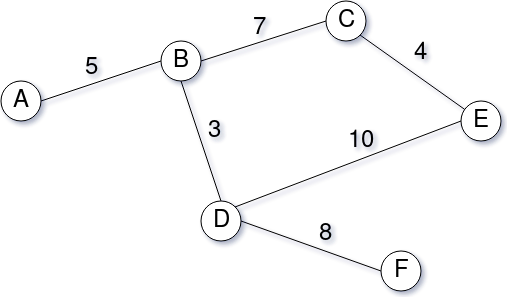

<h1 align="center">
  <br>
  Beverage Delivery
  <br>
</h1>

<h4 align="center">API for beverage delivery logistics</h4>

<p align="center">
    <a alt="Java">
        
    </a>
    <a alt="Spring Boot">
        
    </a>
    <a alt="Maven">
        
    </a>
    <a alt="Docker">
        
    </a>
</p>

## Table of Contents ##
1. [Architecture and Design](#architecture-and-design)
2. [Assumed Assumptions](#assumed-assumptions)
3. [How to Execute](#how-to-execute)

## Architecture and Design ##

The API was developed in Java and uses the Spring Boot framework.

It provides 3 operations:
1. Delivery order registration
2. Vehicle registration
3. Query on ranking of vehicles to attend a delivery order

Details of the requests provided on a Swagger UI (available when application is running)
* http://localhost:8080/swagger-ui.html

All data is stored in memory. Delivery order and vehicle data are stored on a H2 database.
Java sets and maps were used to support the calculus of the shortest distance between an vehicle and a store, using Dijkstra algorithm.

References:
* https://en.wikipedia.org/wiki/Dijkstra%27s_algorithm
* https://www.baeldung.com/java-dijkstra

## Assumed Assumptions ##

* Data is not persisted, so is available only during application execution.

* Cargo capacity of vehicles are not configurable, and is assumed the following capacty and types:
  * **10**: Vehicle type A
  * **20**: Vehicle type B
  * **30**: Vehicle type C
  * **40**: Vehicle type D
  * **50**: Vehicle type E

* Locations and distances are also not configurable. Is assumed the following:



## How to Execute ##

You have 3 options to run the app:
1. java
2. maven
2. docker

Whichever option choose you need to first build the application executable jar. To build and package a Spring Boot app into a single executable Jar file with a Maven, use the below command. You will need to run it from the project folder which contains the pom.xml file.
```
mvn install
```

- Option 1: java

To run the Spring Boot app from a command line in a Terminal window you can you the java -jar command. This is provided your Spring Boot app was packaged as an executable jar file.

```
java -jar target/beverage-delivery-0.0.1-SNAPSHOT.jar
```

- Option 2: maven

You can also use Maven plugin to run the app. Use the below example to run your Spring Boot app with Maven plugin :

```
mvn spring-boot:run
```

- Option 3: docker

Command to build the container :

```
docker build -t beveragedelivery-docker .
```

Command to run the container :

```
docker run -p 8080:8080 beveragedelivery-docker
```

The API can be accessed over http://localhost:8080

A Postman collection is also available [here](./beverage-delivery.postman_collection.json)
                        
